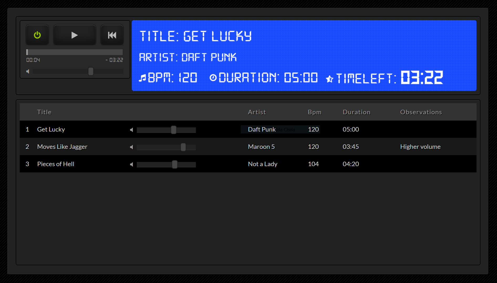

# Track Player

This project is designed to play backing tracks along with a band or simply to listen to your music. It supports MP3 files and provides a user-friendly interface for managing and playing tracks.

## Technologies Used

- **Ruby on Rails**: The backend framework for building the application.
- **Vanilla JavaScript**: For client-side interactivity.
- **MP3 Files**: The format used for audio tracks.

## Getting Started

To get started with the project, follow these steps:

1. **Clone the Repository**:

   ```bash
   git clone <repository-url>
   cd <project-directory>
   ```

2. **Install Dependencies**: Make sure you have the necessary gems installed:

   ```bash
   bundle install
   ```

3. **Set Up the Database**: Run the following commands to set up your database:

   ```bash
   rails db:create
   rails db:migrate
   ```

4. **Start the Server**: To start the Rails server, run:

   ```bash
   rails server
   ```

5. **Access the Application**:
   - Navigate to `http://localhost:3000` to access the player.
   - Go to `http://localhost:3000/admin` to add new tracks.

## Features

- Play backing tracks in MP3 format.
- Admin interface for adding and managing tracks.
- User-friendly design for easy navigation.

## Screenshot



## Contributing

If you would like to contribute to this project, please fork the repository and submit a pull request.

## License

This project is licensed under the MIT License - see the [LICENSE](LICENSE) file for details.
